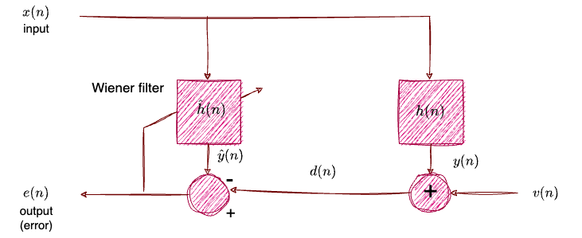
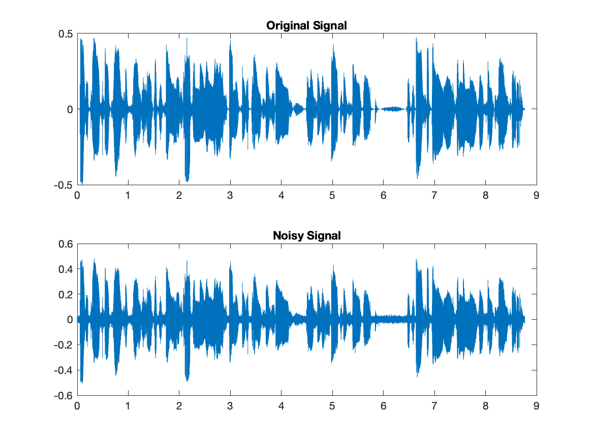

# Last Mean Squares Adaptive Filter
---

This is an online version of Wiener FIR Filter.

---
## LMS Algorithm

1. **Initialisation**
   - $\hat{h}(0)=0$
   - $p$ = filter order
   - $\mu$ = step size

2. **Computation** for $n=0,1,2,...$
   - **Input Vector:** $x(n)=[x(n),x(n-1),...,x(n-p+1)]^T$
   - **Filter Output:** $\hat{y}(n)=\hat{h}^H(n)x(n)=\sum_{i=0}^{p-1}\hat{h}_i(n)x(n-i)$
   - **Error Signal:** $e(n)=d(n)-\hat{y}(n)$
   - **Update Vector:** $\hat{h}(n+1)=\hat{h}(n)+μ e^{\star}(n)x(n)$
     - **$\mu$:** learning rate.
     - $e^{\star}(n)=e(n)$ for signals with real coefficients.

---

## NormalizeLMS Algorithm
Ιt is exactly the same algorithm with the only difference that the weights are renewed based on the following formula:

$$   \hat{h}(n+1)=\hat{h}(n)+ \frac{\mu e^{\star}(n)x(n)}{x^H(n)x(n)} $$

## Noise Removal from Voice Signal

On matlab we implement LMS and NLMS algorithms.

We take voice signal $(d)$ and we add white gaussian noise so we make a new signal $x$.

$$ x=d + n  $$

After that we use the  filters to remove noise with different $\mu$.
